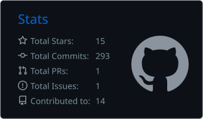
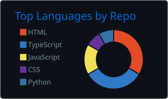
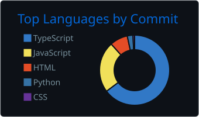

<h1 align="center">

</h1>

<h3 align="center">A passionate AI developer and Tech Explorer</h3>

  

- 🌱 I’m currently learning **DOCKER and RAG**

- 💬 Ask me about **AI GOVERNANCE**

- 📫 How to reach me **sanjaysivakumar71@gmail.com**

<h3 align="left">Connect with me :</h3>

<h3 align="left">Languages and Tools:</h3>

 
      

 

 
  
   
 
 

  

  
  

