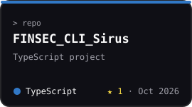
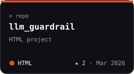

<!-- generated by scripts/build.py from profile.json + live GitHub data; edit profile.json, not this file -->

  

  

hand-drawn by SruSan · redrawn every day from live GitHub data by <a href="scripts/build.py">scripts/build.py</a>

