<!-- generated by scripts/build.py from profile.json + live GitHub data; edit profile.json, not this file -->

  

<a href="https://www.python.org"></a> <a href="https://pytorch.org"></a> <a href="https://huggingface.co"></a> <a href="https://lightgbm.readthedocs.io"></a> <a href="https://pola.rs"></a> <a href="https://www.typescriptlang.org">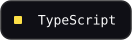</a> <a href="https://developer.mozilla.org/docs/Web/JavaScript">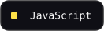</a> <a href="https://developer.mozilla.org/docs/Web/HTML"></a>   <a href="https://www.mysql.com"></a> <a href="https://www.docker.com">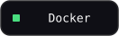</a>   <a href="https://www.kaggle.com">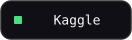</a> <a href="https://www.blender.org"></a> <a href="https://unity.com"></a>

  

hand-drawn by SruSan · redrawn every day from live GitHub data by <a href="scripts/build.py">scripts/build.py</a>

